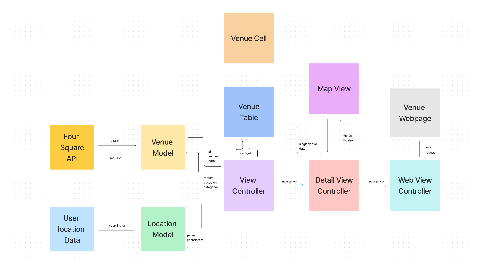

# README – Welcome to Around Town! 


## Summary 

### Architectural Overview

    
## Requirements

    ### Use of at least two screens, all screens should be accessible from another screen
    
    ### Two Screens should have direct interactions 
    
    ### Usage of MVC MVVM architectural pattern
    
    ### Integration with oneAPI
    
    ### Use of at least 5 different UI Components 
        
        1. Labels
        2. Buttons
        3. UIStackViews
        3. TableView
        4. MapView
        5. WKWebView


## Process 

## Libraries / API's Used

    ### Four Square API 
        
    ### Core Location
        
    ### MapKit 
        
    ### WebKit

## How to Setup 

1. Fork this repository. 
    
2. Open up terminal on your machine. 
    
3. In terminal, git clone this repository: 
    ```git clone https://github.com/josiei/AroundTown.git```
        
4. In terminal, cd into the repository and open it:
        ``` 
        cd <repo-name> 
        ```
        ```
        open <repo-name>.xcodeproj
        ```
5. Once the project is open, press the play button in the top left corner. 
    
    Note: This project does not use a package manager like Cocoapods, but you may 
    need to add the WebKit framework to `Frameworks, Libraries, and Embedded Content`
    in the General settings depending on your version of Xcode. 

## Decisions and Tradeoffs

    ### MVC Pattern
        
    ### Using delegate pattern for venueTable in ViewController 
        
    ### Passing data through using a property for DetailViewController and WebViewController
        
    ### Encapsulating MapView and Venue Cell
        
    ### Using Image Cache 
        
    ### Using Notification center for detecting change in user's location
        
    ### Using a combination of AutoLayout and Stacks Views to layout UI programmatically
    
    ### Use of animations 

## Future Optimizations 

    ### Adding directions from user's location to venue's location
    
    ### Adding the ability to click the phone number and have a pop up that asks if you'd like to call the number 
    
    ### Investigating other API's like Foursquare places to see if they contain more data to integrate 
    
## 

