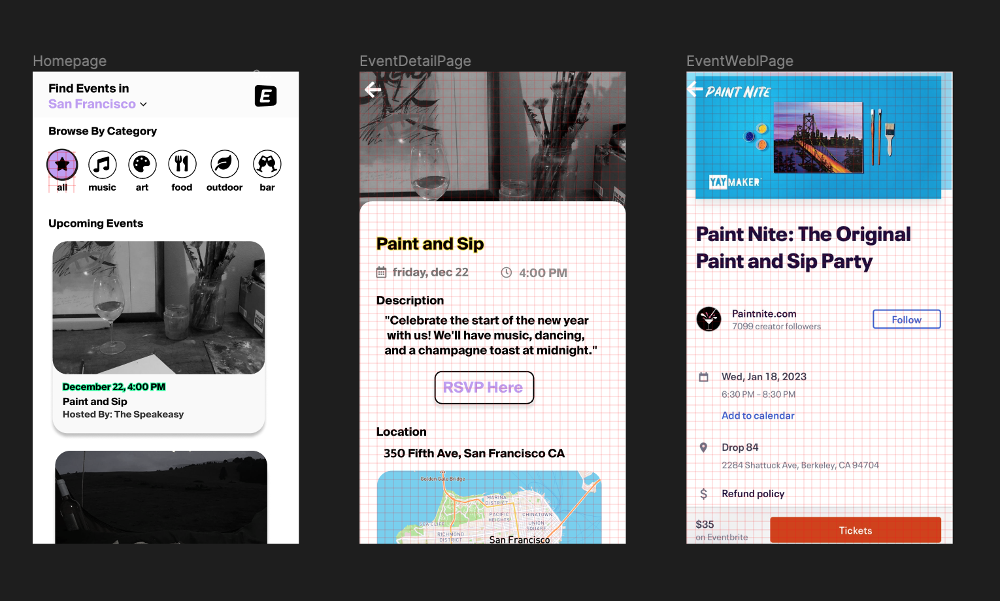

# README – Welcome to Around Town! 


This gif demonstrates the general walkthrough of the application. 

## Summary 

    AroundTown is an app that allows users to see cool places near them based on what the 
    type of venue they are looking for. It leverages the FourSquare API to source places 
    based on the user's coordinates. Users can scroll a table view of populated results, 
    and click on a card to take them to a detailed view of the location. The detailed view 
    contains information like the address, website, and telephone number. It also includes 
    a map view, so the user can see what part of the city it is located in. Additionally 
    the user can navigate to the venue's webpage.

### Architectural Overview


A Visual Overview of the relationships within the app 
    
    I designed this application using the MVC architectural pattern. With this being the case, 
    I wanted to separate the data fetching classes into Models, so the VenueModel is the only 
    part of the application that interacts with the FourSquare API. Additionally, I created an 
    LocationModel to handle the parsing and communication of the user's location. 
    These two models send information based on the ViewController's request, allowing the 
    ViewController to contain access the the entire venues data object. 
    
    To display each venue, I made the ViewController the delegate of the venueTable object. I 
    implemented a custom venueCell class to achieve my desired look for the tableCell, and 
    registered it to the venueTable object. Through the venueTable's protocol methods in the 
    View Controller, I was able to pass the single venue object to the detailViewController 
    when the user clicked the venue card by assigning it to the venue property in 
    detailViewController. I then populated the view for detailViewController using the venue object. 
    The venue object contained the street address for the location, which I sent to my MapView 
    class to display and set up the mapView. 
    
    Lastly, I implemented a clickHandler for the website section in the detailViewController 
    that adds the WebViewController to the navigation stack. The detailViewController assigns 
    the website url to a property contained in WebViewController. WebViewController then uses 
    this information to make a url request to display the venue's webpage. 
    
## Requirements

    ### Use of at least two screens, all screens should be accessible from another screen
    
    My app contains three screens, each managed by a separate ViewController. They can be 
    navigated in a linear fashion. The home ViewController leads to the detailViewController, 
    which leads to the WebViewController. 
    
    ### Two Screens should have direct interactions
    
    My first screen contains a tableView that is populated with individual table cells. The user can 
    click on each of these cells to take then to the detailViewController. The ViewController for the 
    first screen is the delegate for this table, and allows the information to be passed through the 
    use of the delgate pattern. My second screen, the detail view page for the venue, has a direct 
    interaction, where the user can click on the "Visit our Website" label to trigger a clickHandler
    that passes the websiteUrl to the WebViewController. 
    
    ### Usage of MVC MVVM architectural pattern
    
    I decided to use the MVC architectural pattern, as it was reccommended in the Apple Developer 
    Documentation. My architectural overview above provides some context into how my classes fell 
    into the defined categories of Model, View, and ViewController Categories. Additionally, I 
    chose to separate the View classes by matter of reuseability or if I felt they may need expanded 
    functionality, leading me to have separate classes for the VenueCell and the MapView. For more 
    static user interface elements, such as labels, text, and images – I decidedto define it in the 
    ViewController, as the ViewController already had access to the data I would populate it with. 
    
    ### Integration with oneAPI
    
    I chose to use the FourSquare API, as I was interested in building something I could use in my 
    everyday life and was very interested in the opportunity to work with real world data. 
    
    ### Use of at least 5 different UI Components 
        
        1. Labels
            Labels appear throughout my app to convey information to the user. Some examples include 
            the userLocation label that signal what city the user is looking at venue's in, as well 
            as displaying the name of the venue on the venueCell cards, and in the detail view to 
            show the information for that venue. 
            
        2. Buttons
            I have a set of buttons on my first screen representing the category of places the 
            user can make queries for. By default, the "all" button is selected, but if you click 
            on another button, it will set that button to be selected and populate the table with
            the corresponding venues. 
            
        3. UIStackViews
            I used stack views within my first two screen, to organize the views. I used a horizontal 
            StackView to lay out my buttons equally,and composed that within several vertical 
            StackViews to make it easier to organize the layout. 
            
        4. TableView
            I chose to use a TableView in my first screen to display the cards, over a collection 
            view, because I knew I wanted a single direction scrollable list over the customization 
            and potential complexity of the collection view. 
            
        5. MapView
            I chose to display a map view in my detail view screen as I wanted the user to be able 
            to see what part of the city their venue was in. This allows them to get a better 
            picture of what is near by in the area. 
            
        6. WKWebView
            The WKWebView takes up the entirety of my third screen, when the user clicks on the 
            website link from the detail view screen. I was interested in implementing something 
            that made another http request to outside data. 


## Process 



I was interested in building a project I could use in my everyday life, which drew me to using the Foursquare Places API. On first glance, 
I noticed the Places could return events based on a venue in an area. This lead me to my initial idea, where I thought I would 
create an app that displayed local events happening in your area, where you can filter it by what you'd like to do.  I am a very 
visual person, so once I had brainstormed an idea, I decided to do a rough outline of what the app's user interface could possibly look like.

After I had an idea of what I was looking to implement, I began playing around with the Foursquare API when I realized Events was a 
legacy feature and was no longer supported. This is when I pivoted to Around Town, and decided to return venues based on your location. 

From here, I came up with a list of User Stories to give me an idea of what I had to accomplish to reach my MVP. 

This list included: 

- User will be able to allow their location to be used by the app
- If user denies their location to be shared, the app will show them places in a default location
- User will be presented a Home Screen with their location and shown places near them
- User will be able to change the category of venues they would like to see 
- User will be able to be click on a card and taken to a detail page where they can see more information about the venue 
- On the detail page, the user will be able to see a map where the venue is located 
- If the user clicks the website link, the user can view the venues website in the app 

From here, it was off to the races to begin doing research. Overall, it took me roughly 40 hours to get my MVP running. This was truly an incredible 
experience as I had no previous experience with Swift or IOS development before this application cycle. 


## Libraries / API's Used

    ### Four Square API 
        
    ### Core Location
        
    ### MapKit 
        
    ### WebKit

## How to Setup 

1. Fork this repository. 
    
2. Open up terminal on your machine. 
    
3. In terminal, git clone this repository: 
    ```git clone https://github.com/josiei/AroundTown.git```
        
4. In terminal, cd into the repository and open it:
        ``` 
        cd <repo-name> 
        ```
        ```
        open <repo-name>.xcodeproj
        ```
5. Once the project is open, press the play button in the top left corner. 
    
    Note: This project does not use a package manager like Cocoapods, but you may 
    need to add the WebKit framework to `Frameworks, Libraries, and Embedded Content`
    in the General settings depending on your version of Xcode. 

## Decisions and Tradeoffs

    ### MVC Pattern
        
    ### Using delegate pattern for venueTable in ViewController 
        
    ### Passing data through using a property for DetailViewController and WebViewController
        
    ### Encapsulating MapView and Venue Cell
        
    ### Using Image Cache 
        
    ### Using Notification center for detecting change in user's location
        
    ### Using a combination of AutoLayout and Stacks Views to layout UI programmatically
    
    ### Use of animations 

## Future Optimizations 

    ### Adding directions from user's location to venue's location
    
    ### Adding the ability to click the phone number and have a pop up that asks if you'd like to call the number 
    
    ### Investigating other API's like Foursquare places to see if they contain more data to integrate 
    
## 

